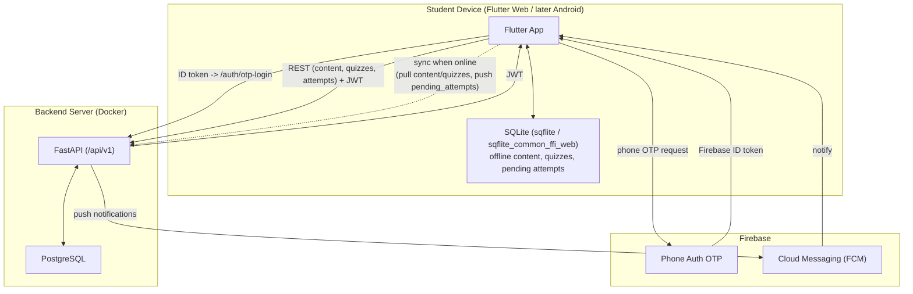

# System Architecture

## Notes
- The Flutter app works offline-first: content, subjects, and quizzes are cached in on-device SQLite. Quiz attempts made offline are stored in `pending_attempts` and synced to the server once connectivity returns.
- Firebase handles phone OTP for students (and FCM for notifications, later sprint). The backend never talks to Firebase for OTP delivery — only to verify the ID token the app receives.
- The backend issues its own JWT after verifying the Firebase token (or email/password for teacher/admin), and all protected endpoints check that JWT plus role.
