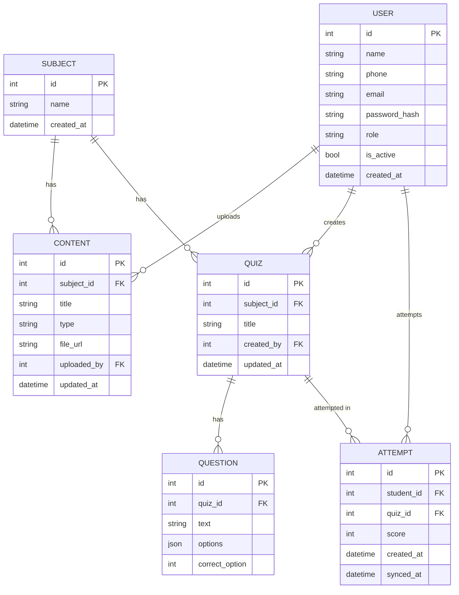

# Database Design

## ER Diagram (Server — PostgreSQL)

## PostgreSQL (server) vs SQLite (device)
- **PostgreSQL** is the single source of truth: all users, subjects, content, quizzes, questions, and attempts live here. Managed via SQLAlchemy models + Alembic migrations (see `backend/app/models.py`, `backend/migrations/`).
- **SQLite** (see `docs/offline-schema.sql`) is a lightweight read-mostly cache on the student's device, holding only what's needed to learn and attempt quizzes offline (subjects, content, quizzes, questions), plus a `pending_attempts` table with a `synced` flag for attempts made while offline. The `updated_at` columns on the server let the device pull only what changed since its last sync; `pending_attempts` rows are pushed to `/attempts` and marked synced once the server confirms.
