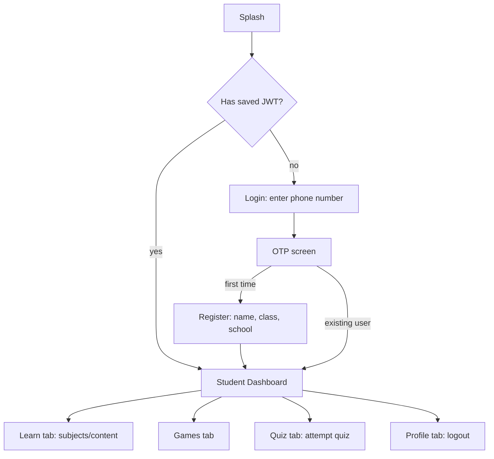
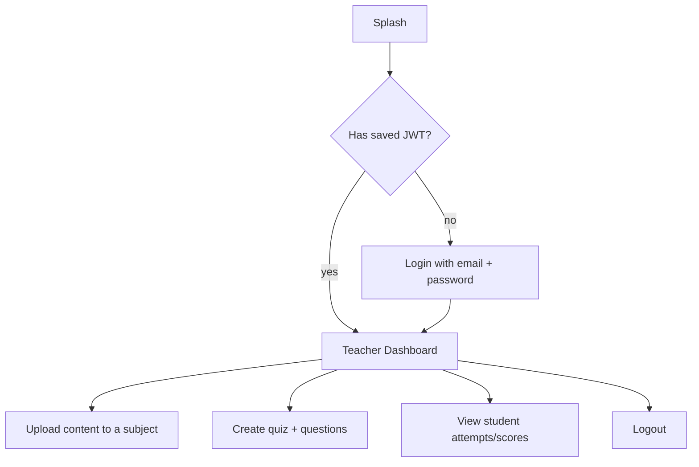
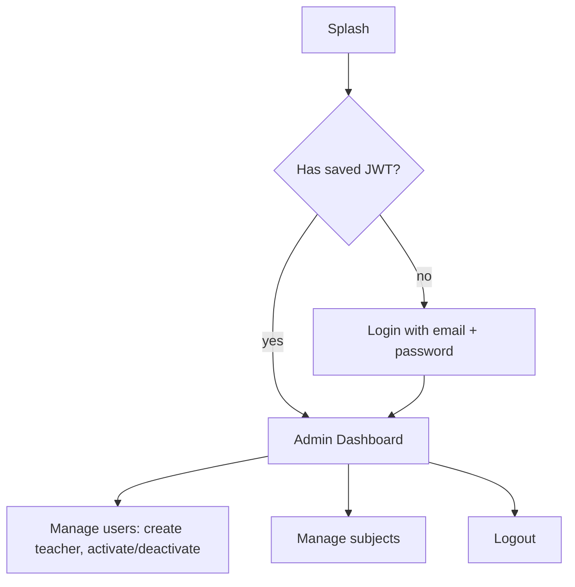

# User Flows

## Student

```mermaid
flowchart TD
    A[Splash] --> B{Has saved JWT?}
    B -- yes --> C[Student Dashboard]
    B -- no --> D[Login: enter phone number]
    D --> E[OTP screen]
    E -- first time --> F[Register: name, class, school]
    F --> C
    E -- existing user --> C
    C --> G[Learn tab: subjects/content]
    C --> H[Games tab]
    C --> I[Quiz tab: attempt quiz]
    C --> J[Profile tab: logout]
```

## Teacher

```mermaid
flowchart TD
    A[Splash] --> B{Has saved JWT?}
    B -- yes --> C[Teacher Dashboard]
    B -- no --> D[Login with email + password]
    D --> C
    C --> E[Upload content to a subject]
    C --> F[Create quiz + questions]
    C --> G[View student attempts/scores]
    C --> H[Logout]
```

## Admin

```mermaid
flowchart TD
    A[Splash] --> B{Has saved JWT?}
    B -- yes --> C[Admin Dashboard]
    B -- no --> D[Login with email + password]
    D --> C
    C --> E[Manage users: create teacher, activate/deactivate]
    C --> F[Manage subjects]
    C --> G[Logout]
```
